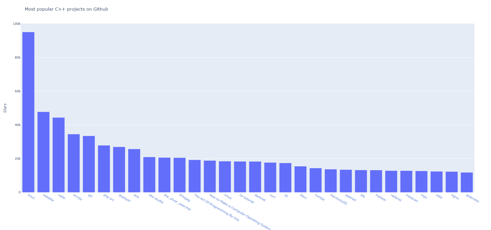

# Objective
Top 20 most popular C++ GitHub projects are visualized with Plotly with the help of GitHub API endpoint. 

# Sample generated visualization
Output visualization is saved in "popularity_of_py_repos.html" file. 

